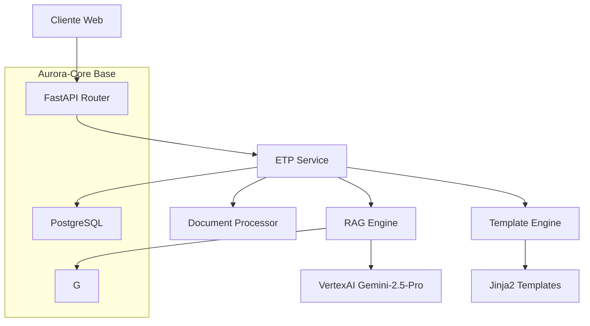

# Arquitetura: Gerador de ETPs

## Padrão Arquitetural

**API RESTful com Pipeline RAG Assíncrono**

- Arquitetura baseada em microserviços dentro do Aurora-Core
- Pipeline de processamento assíncrono para documentos
- Cache inteligente para consultas frequentes

## Diagrama de Componentes

## Componentes Principais

### ETP Service

- **Responsabilidade:** Orquestração do pipeline de geração
- **Tecnologia:** Python/FastAPI

### Document Processor

- **Responsabilidade:** Extração e processamento de documentos
- **Tecnologia:** PyMuPDF + python-docx + spaCy
- **Output:** Texto estruturado + entidades

### RAG Engine

- **Responsabilidade:** Consulta semântica e geração contextual
- **Estratégia:** Retrieval híbrido (semântico + keyword)

### Template Engine

- **Responsabilidade:** Formatação final do ETP
- **Tecnologia:** Jinja2
- **Templates:** Estrutura padronizada por tipo de obra

## Composição de Agentes (AoE)

### Fusão de Modelos Ideal

- **70% Gemini-2.5-Pro:** Raciocínio complexo e análise de requisitos
- **30% DeepSeek-Coder:** Formatação técnica e estruturação de documentos

### Pipeline de Processamento

1. **Análise:** Gemini-2.5-Pro processa requisitos e contexto
2. **Estruturação:** DeepSeek-Coder organiza informações em formato ETP
3. **Validação:** Gemini-2.5-Pro revisa consistência e completude

## Fluxo de Dados

1. Upload de documentos → Document Processor
2. Input do usuário → ETP Service
3. Consulta RAG → VertexAI
4. Geração estruturada → Template Engine
5. ETP final → Cliente
